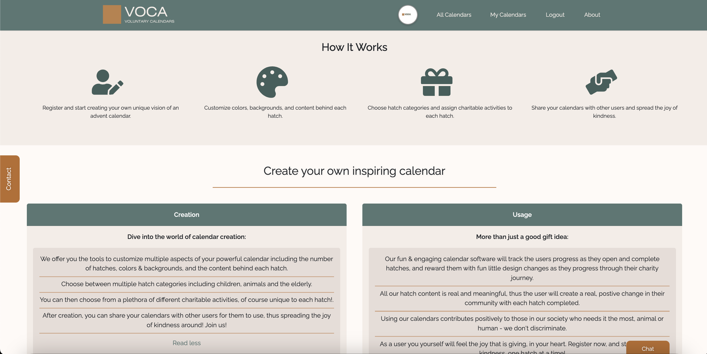
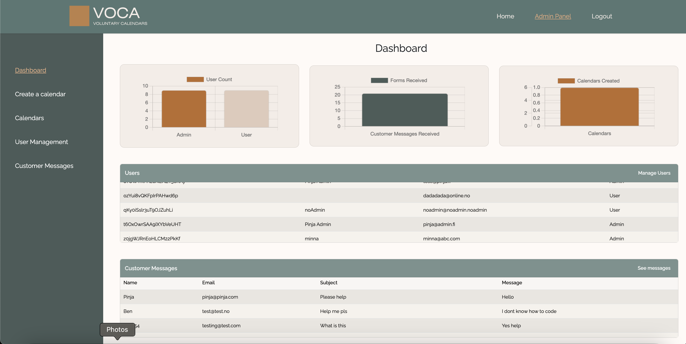
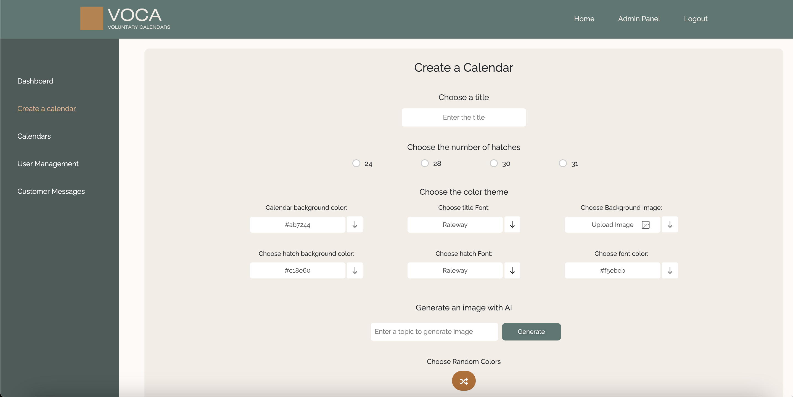
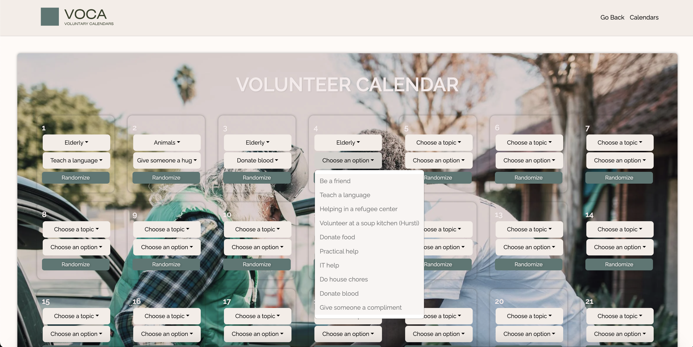
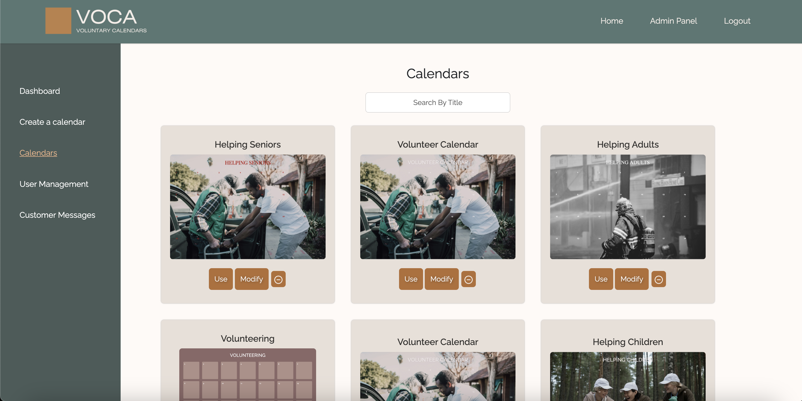
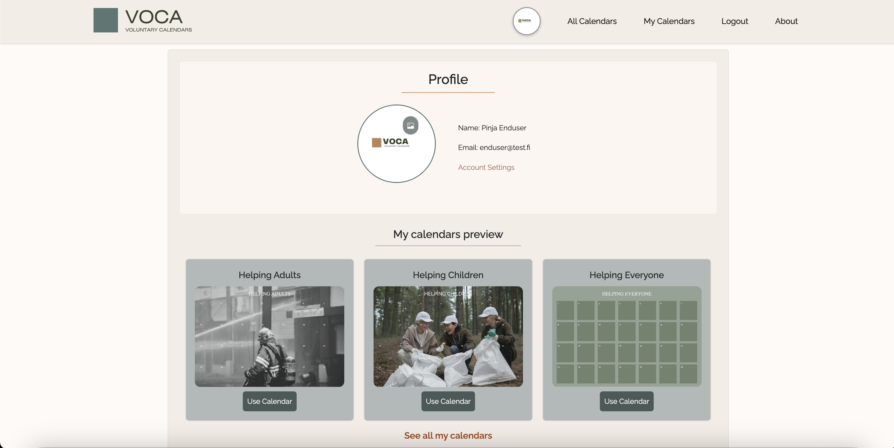
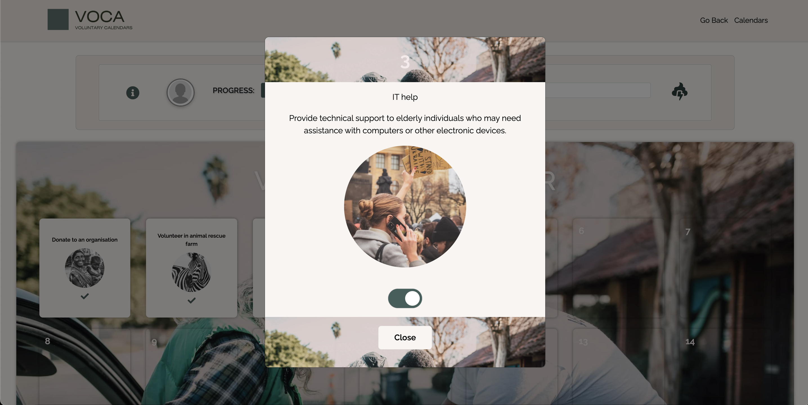
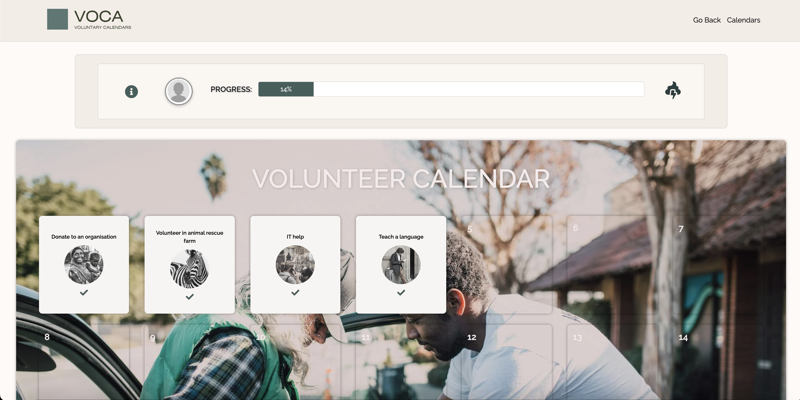
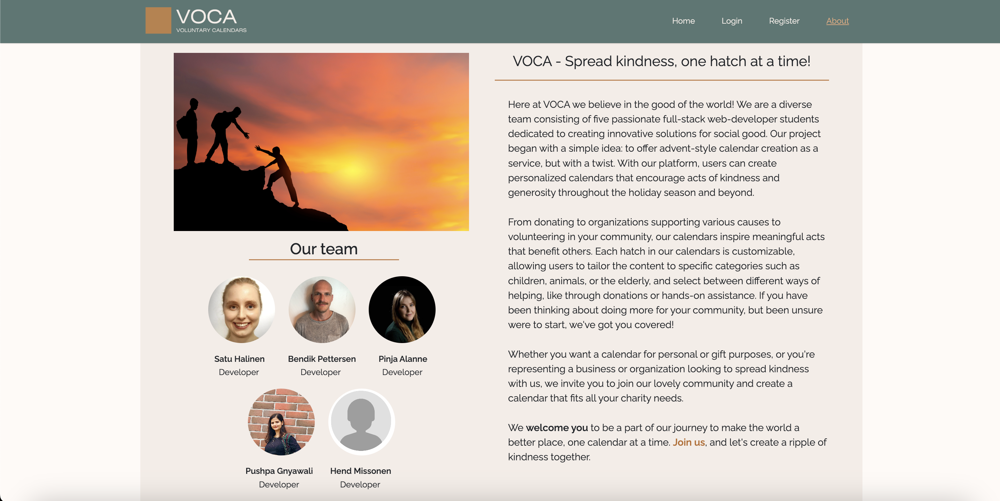

# VOCA - Voluntary Calendars

## Description

This is the final group project for the Full-stack Web Developer program in Business College Helsinki.
Our assignment was to create a React based 'calendars as a service' full-stack app using technologies covered in our program.

The goal of our app is to offer advent-style calendar creation as a service, but with a twist.
With our platform, users can create personalized calendars that encourage acts of kindness,
generosity and voluntary work throughout the holiday season and beyond.

From donating to organizations supporting various causes to volunteering in your community, our calendars inspire meaningful acts that benefit others. Each hatch in our calendars is customizable, allowing users to tailor the content to specific categories:
animals, children & teenagers, adults, and the elderly and select between different ways of helping, like through donations or hands-on assistance.

## Features

### Before Logging In:

- **Marketing Page**: Introduce VOCA and its mission to promote acts of kindness through customizable calendars.
- **About Us Page**: Learn more about the diverse team behind VOCA and our dedication to social good.
- **Terms and Conditions**: Review the terms of service and usage policies before registering.
- **Contact Us Page & Popup**: Easily reach out to the VOCA team for inquiries or support via the contact page or a convenient popup form.
- **AI Chat**: Engage in interactive conversations with an AI chatbot to learn more about VOCA and our features.
- **Register Page**: Sign up for a VOCA account to access personalized calendar creation and management features.
- **Login Page**: Securely log in to your VOCA account to manage your calendars and settings.

### Logged in as Admin:

- **Dashboard**: Access a centralized dashboard providing an overview of application's activities and metrics.
- **User Management**: Manage user accounts within the VOCA platform.
- **Customer Messages**: Monitor customer inquiries and feedback received through the Contact page.
- **Create a Calendar**: Generate customizable calendars manually or with AI-generated images to inspire acts of kindness.
- **Calendars**: View a list of all calendars created within the platform.
- **Modify Old Calendar**: Edit existing calendars to update content, themes, or configurations as needed.
- **Delete Calendar**: Remove unwanted calendars from the system to maintain a clutter-free environment.

### Logged in as End-user:

- **Profile**: Access and manage user profile information, including the option to upload a profile image.
- **Account Settings**: Customize account preferences, such as changing name or resetting email and password.
- **All Calendars**: Explore a catalog of all available calendars created by VOCA admins, searchable by title.
- **My Calendars**: Access a personalized list of calendars saved to your account for easy reference.
- **Active Calendar**: Interact with active calendars by opening hatches, marking tasks as completed, and tracking progress.
- **Save to My Calendars and Remove from My Calendars**: Add or remove calendars from your personal My Calendars page.
- **Responsive Design for Mobiles**: As an End-user you can browse, save and use the calendars also using mobile device!

### Additional Features:

- **Header Change**: Dynamically changing header color and content based on the user, switching between admin and end-user views seamlessly.

## Technologies Used

### Frontend:

- React with Vite
- Redux as state management
- React Bootstrap
- CSS

### Backend/Database:

- Firebase

### Design:

- Figma
- Canva

### Project Management Tool:

- Jira

### Workflow:

- GitHub Actions

### Code Analysis:

- SonarCloud

## Setup

### Prerequisites

Make sure you have the following installed on your machine:

- Node.js (v14 or higher)
- npm (v6 or higher)
- Firebase
- Git

### Frontend Setup

1. **Clone the Repository**:
    ```bash
   git clone https://github.com/satuhalinen/calendar.git
   cd voca
   ```

2. **Install Dependencies**:
    ```bash
    npm install
    ```

3. **Start the Development Server**:
    ```bash
    npm run dev
    ```

4. **Access the Application**:
- Open your browser and navigate to localhost

### Backend Setup:

#### Firebase Configuration:

1. **Create a Firebase project** at [Firebase Console](https://console.firebase.google.com/).
2. **Enable Firestore, Authentication,** and any other necessary Firebase services.
3. **Obtain your Firebase configuration object** from the Firebase console.

#### Configure Firebase in the Project:

1. **Create a `.env` file** in the root of the project and add your Firebase configuration:
   ```plaintext
   VITE_FIREBASE_API_KEY=your_api_key
   VITE_FIREBASE_AUTH_DOMAIN=your_auth_domain
   VITE_FIREBASE_PROJECT_ID=your_project_id
   VITE_FIREBASE_STORAGE_BUCKET=your_storage_bucket
   VITE_FIREBASE_MESSAGING_SENDER_ID=your_messaging_sender_id
   VITE_FIREBASE_APP_ID=your_app_id


## Visuals

### Marketing Page

 

### Dashboard



### Calendar Creation




### Admin Calendars



### User Profile



### Calendar Interaction




### About us

